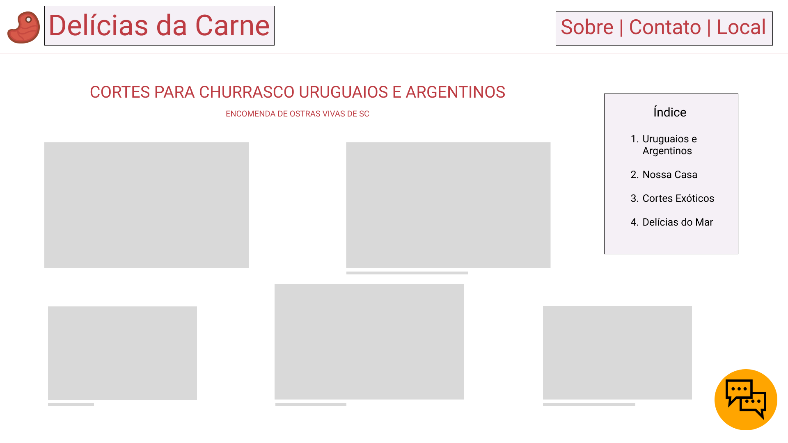
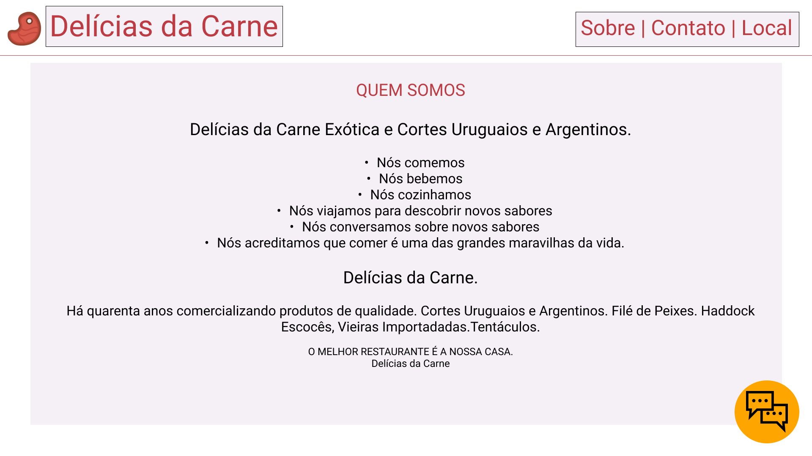
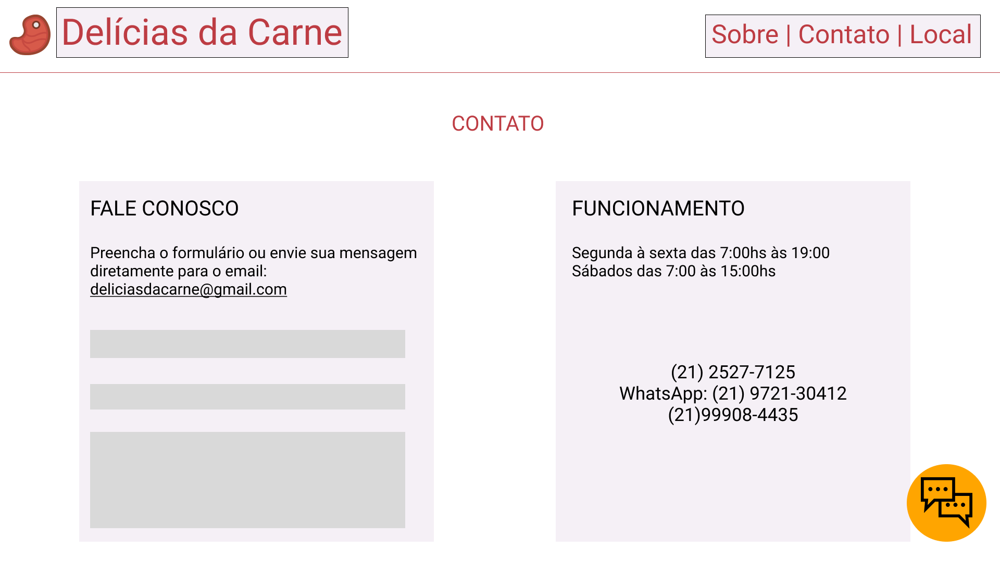
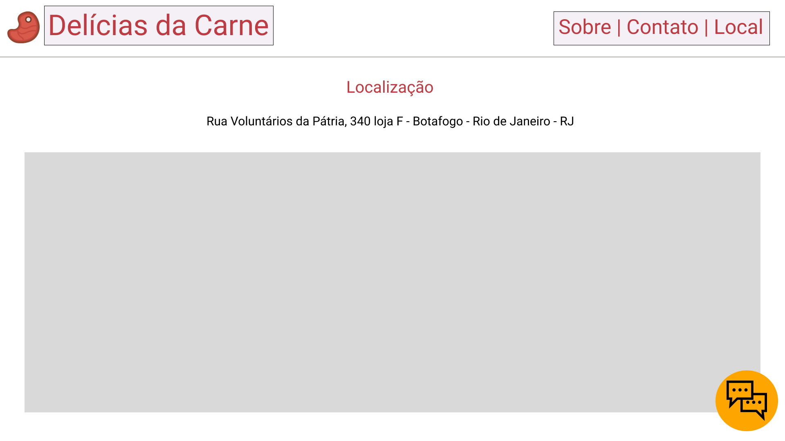

# **Projeto Delícias da Carne**

## Problemas:
- Título fixado na tela do usuário;
- Escolha da imagem de fundo atrapalha a visualização e leitura;
- Poluição visual;
- Cores e fontes atrapalham a experiência visual do usuário;
- Múltiplas informações na mesma página, quando poderiam ser divididas;
- Fazer uma lista na seção "QUEM SOMOS";
- Erros gramaticais.

## Escolhas:
- Simplificar o design e melhorar a estrutura;
- Tornar a navegação do usuário mais simples (dividindo seções diferentes em múltiplas páginas);
- Cores: #BD3C43 para títulos principais, #F5F0F6 para fundo de containers, #FFFFFF para o fundo da página, #000000 para outras escritas;
- Fontes: padronizar o uso de fontes com Roboto (com possíveis exceções).

## Esboço:

